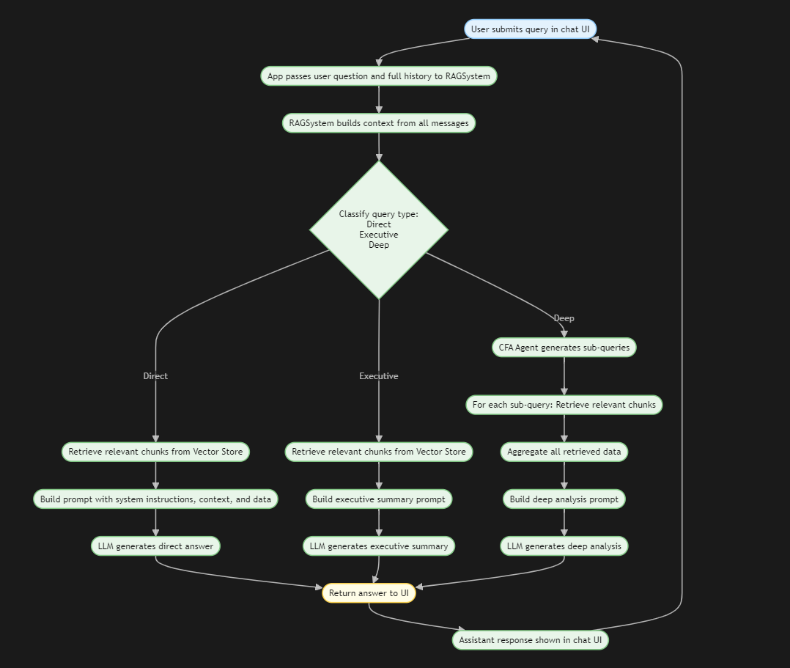

# Welcome to LumenAI RG Chat! 🚀🤖

Welcome to LumenAI RG Chat, your advanced financial analyst and executive advisor chatbot for RateGain Travel Technologies. This application is designed to provide comprehensive insights into RateGain's financial performance.

## Architecture Overview 🏗️

Here's a high-level overview of the system architecture:

## What can I do? 💡

LumenAI RG Chat leverages a sophisticated RAG (Retrieval Augmented Generation) system to answer your questions. It can act in several capacities:

*   **Senior Chartered Financial Analyst (CFA)**: For in-depth financial analysis, including root cause analysis, trend identification, and detailed metric breakdowns.
*   **Executive Advisor**: For concise, high-level business insights and strategic summaries.
*   **Direct Factual Assistant**: For quick, accurate answers to specific questions about RateGain's financials, segments, and products.

## Data Coverage 📊

The chatbot has access to RateGain's Investor Presentation on Un-audited (Standalone and Consolidated) Financial Results for all four quarters, and MIS Reports covering data from **April 2024 - March 2025**.

## How to Ask Questions 🤔

You can ask various types of questions to get the insights you need:

*   **Direct Factual Questions**: "What was the revenue for DaaS in Q1 2024?"
*   **Executive Analytical Questions**: "Summarize the performance of the Distribution segment in Q3."
*   **Deep Analytical Questions**: "Analyze the EBITDA trends for Hospi BI and explain the drivers." or "Elaborate on the NRR for the last two quarters."

The system can analyze key metrics such as Revenue, EBITDA, Costs, Top Accounts, NRR (Net Revenue Retention), GRR (Gross Revenue Retention), Retention, Monetization, Department Spending, "Rule of 40", Sales Multiple, and LTV2CAC (LTV to Customer Acquisition Cost ratio).

## Important Notes ⚠️

*   The chatbot uses only the provided RateGain data and context. It does not use external or fabricated information.
*   If data is missing or a question is outside its scope, it will clearly state so.

## Welcome Screen

On the welcome screen, the app is ready to use when you see `LumenAI RG-MIS Chatbot Ready...` Simply go ahead and ask any question within its scope, and it will provide an answer.

We hope you find LumenAI RG Chat a valuable tool for your financial analysis needs! Happy querying! 💻😊
